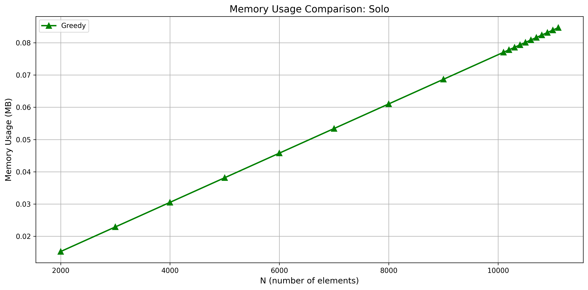

# Subset Sum Problem

## Problem Statement

Let be a set consisting of `𝑁` objects. Each object `𝑖` has an associated integer value `𝑣𝑖`. Identify a subset of objects such that the sum of their values ​​is exactly `𝑇`.

**Input data format**

On the first line are two numbers, `𝑁` and `𝑇`.
On the next `𝑁` lines there will be an integer `𝑣𝑖`,
signifying the value of each object.

**Output data format**

On the first line is the number of objects chosen from the crowd.
On the second line there will be indexes of the selected objects.
If there are multiple solutions, any can be displayed.

**Restrictions:**

1 <= 𝑁 <= 10000

1 <= 𝑇 <= 1000000

-1000000 <= 𝑣𝑖 <= 1000000

## Solution

This project implements three different methods for solving the **Subset Sum** problem: **Backtracking**, **Dynamic Programming (DP)**, and **Greedy**. Each method has distinct characteristics in terms of efficiency, complexity, and the specific cases where it performs optimally or suboptimally.

## Note

First 6 test are for the correctnes of the 3 methods and have references to the correct answers; the other tests are for benchmark

## Resolution Methods

### 1. Backtracking

#### **Functionality**

The **Backtracking** method explores all possible combinations of elements from the given set to determine if there exists a subset that sums up to the target value **T**.

**Key Steps:**
1. **Include**: Includes an element in the subset and reduces the target value **T** by the value of the included element.
2. **Exclude**: Excludes the current element and continues to explore subsets without it.
3. **Recursion**: Repeats the steps for each element until **T** becomes 0 (solution found) or all combinations have been explored without success.

#### **Advantages**
- Finds all possible solutions, guaranteeing a correct solution if one exists.
- If the solution contains as many numbers as possible at the beginning of the vector, then this method is faster
- The algorithm is not influenced by the size of the element values ​​or the sum
- Managing negative numbers does not significantly affect the method, though it increases the search space.
- Not significantly affected by the distribution of positive or negative values.

#### **Disadvantages**
- **Inefficient** for large datasets due to exponential complexity (`O(2^N)`).
- Execution time increases significantly with larger datasets.
- If the solution contains as many numbers as possible at the end of the vector, then this method becomes very inefficient
- As the input data are random numbers, the larger the input size, the more dependent on luck and respectively variable over time this method becomes

#### **Use Cases**
- Suitable for small to medium-sized datasets.
- Efficient when there are few possible solutions.

### 2. Dynamic Programming (DP)

#### **Functionality**

The **Dynamic Programming** method utilizes a memoization approach to avoid unnecessary recalculations by constructing a one-dimensional table that keeps track of possible sums using the available elements. This approach efficiently handles negative numbers by adjusting an offset, ensuring that all possible sums are accounted for within the DP table.

**Key Steps:**
1. **Initialization**:  
   Calculate the total sum range considering both positive and negative numbers. An offset is applied to handle negative sums, ensuring that the DP table indices represent all possible sums.

2. **DP Table Construction**:  
   Create a one-dimensional DP table (`dp`) where each index represents a possible sum offset by the calculated value. Initialize the table with `dp[offset] = true` to denote that a sum of zero is achievable initially.

3. **Populating the DP Table**:  
   Iterate through each element in the array and update the DP table accordingly:
   - **Positive Numbers**:  
     For each positive element, iterate the DP table in reverse to update achievable sums without recounting elements.
   - **Negative Numbers**:  
     For each negative element, iterate the DP table forward, adjusting indices based on the negative value.

4. **Solution Check and Reconstruction**:  
   After populating the DP table, check if the target sum `T` is achievable by verifying `dp[T + offset]`. If achievable, reconstruct the solution by tracing back the elements that contributed to the target sum.

#### **Advantages**
- Can handle larger input sizes compared to backtracking, with a time complexity of `O(T * N^2)` where `N` is the number of elements and `T` is the target sum.
- Ensures a correct solution if one exists.
- If the solution contains as many numbers as possible at the beginning of the vector, then this method is faster

#### **Disadvantages**
- Requires significant memory and time proportional to the range of possible sums and elements, which can be impractical for very large or highly negative/positive sums.
- If the solution contains as many numbers as possible at the end of the vector, then this method becomes less efficient
- Requires adjusting the offset to handle negative sums, which can increase memory consumption.
- Works well with both unique and duplicate elements, though performance may vary based on element repetition.

#### **Use Cases**
- Suitable for moderate-sized datasets where the target sum `T` and element values is within a manageable range.
- Particularly effective when the dataset includes both positive and negative numbers, utilizing the offset technique to account for the entire sum range.

### 3. Greedy

#### **Functionality**

The **Greedy** method selects elements from the set based on a specific rule (typically in descending order of their values) to try to get as close as possible to the target sum **T**.

**Key Steps:**
1. **Sorting**:  
   Sort the elements in the desired order (descending or ascending) based on the sign of **T**.
2. **Selection**:  
   Traverse the sorted elements and add those that help in approaching the target sum **T**.
3. **Termination Criterion**:  
   Stop if the current sum is sufficiently close to **T** (e.g., the difference is within 10% of **T**).

#### **Advantages**
- Generally has a lower time complexity of `O(N log N)` due to sorting.
- Fast and efficient for large datasets, especially when an approximate solution is acceptable.

#### **Disadvantages**
- May fail to find a solution even if one exists.
- May not provide an exact solution, as it aims to approximate the target sum.
- May not provide the best approximation to the target sum, if the best solution contains more than one element
- May struggle with negative numbers since the selection rule can be compromised.

#### **Use Cases**
- Useful in scenarios where a quick approximate solution is acceptable and speed is a priority.
- Efficient for large datasets where exact methods are impractical due to time constraints.

## Trade-offs Between Methods

| Method                | Efficiency | Space  | Accuracy   | Scalability    |
|-----------------------|------------|--------|------------|----------------|
| Backtracking          | Low        | Low    | Exact      | Limited        |
| Dynamic Programming  | Medium     | High   | Exact      | Moderate        |
| Greedy                | High       | Low    | Approximate| High           |

- **Backtracking** offers an exact solution but is not scalable for large datasets.
- **Dynamic Programming** balances efficiency and accuracy, making it suitable for medium-sized datasets.
- **Greedy** is very fast and scalable but sacrifices solution precision.

## How to Run

>python3 generate_tests.py
>
>g++ -std=c++11 -isystem benchmark/include     -Ibenchmark/include     DP.cpp SubsetSum.cpp Greedy.cpp Backtracking.cpp benchmark_main.cpp     -Lbenchmark/build/src -lbenchmark -lpthread -o SubsetSumBenchmarks
>
>./SubsetSumBenchmarks
>
>python3 plot_results.py

## My hardware configuration

- **Operating Systems**: 
1. Windows 11 Pro, 64-bit
2. Ubuntu 22.04.5, LTS 5.15.167.4-microsoft-standard-WSL2, x86-64
- **Processor**: 13th Gen Intel Core i7-13650HX
- **RAM Memory**: 16 GB
- **Graphics Card**: NVIDIA GeForce RTX 4050 Laptop GPU
## Tests

Each test is build with the size of the vector, the sum and size of each number being a balanced value, for unbalanced cases we documented the reaction of the previous methods

## Performance

### Execution Time

#### Trio (Tests 7-26)

The **Trio** range evaluates the **Backtracking**, **Dynamic Programming (DP)**, and **Greedy** methods. The execution time graph for this range illustrates that:
- **Backtracking** exhibits an exponential increase in execution time as **N** grows, highlighting its computational complexity.
- **Dynamic Programming** shows a moderate increase in execution time with larger inputs, balancing efficiency and performance.
- **Greedy** maintains a consistently low execution time regardless of **N**, demonstrating its high efficiency.

#### Duo (Tests 27-34)

The **Duo** range assesses the **DP** and **Greedy** methods. The execution time graph indicates that:
- **Dynamic Programming** continues to display a gradual increase in execution time with larger datasets.
- **Greedy** remains highly efficient with minimal execution time, reinforcing its scalability for larger problem sizes.

#### Solo (Tests 35-53)

In the **Solo** range, only the **Greedy** method is analyzed. The execution time graph confirms that:
- **Greedy** consistently performs with rapid execution times, even as **N** reaches higher values, solidifying its suitability for large-scale problems.

### Memory Usage

#### Trio (Tests 7-26)

The memory usage graph for the **Trio** range demonstrates that:
- **Backtracking** consumes relatively low memory despite its exponential time complexity.
- **Dynamic Programming** requires significantly more memory to manage the DP table, especially as **N** increases.
- **Greedy** utilizes minimal memory, aligning with its efficient execution time performance.

#### Duo (Tests 27-34)

For the **Duo** range, the memory usage graph shows that:
- **Dynamic Programming**'s memory consumption continues to rise with larger inputs, though it remains within manageable limits.
- **Greedy** sustains its low memory footprint, unaffected by the scale of **N**.

#### Solo (Tests 35-53)

In the **Solo** range, the memory usage graph confirms that:
- **Greedy** consistently uses minimal memory resources, ensuring scalability and efficient memory management for extensive datasets.

## Conclusion

Choosing the right method for solving the **Subset Sum** problem depends on the specific characteristics of the dataset and application requirements. For small sets requiring exact solutions, **Backtracking** is ideal. For medium-sized sets balancing efficiency and precision, **Dynamic Programming** is recommended. For large sets where speed is essential and an approximate solution is acceptable, the **Greedy** method provides a suitable trade-off.